<div align="center">


# Garioli Labs — plataforma

**Do primeiro contato ao contrato assinado, em um sistema só.**
SvelteKit 5 no front, Axum (Rust) na API, uma identidade visual do site público ao painel administrativo.

[](https://github.com/LucasGarioli/garioli.labs-website.demo/actions/workflows/ci.yml)
[](https://demo.gariolilabs.com)
[](https://github.com/tokio-rs/axum)
[](https://svelte.dev)
[](https://developers.cloudflare.com/workers/)

**[▶ Abrir a demonstração](https://demo.gariolilabs.com)** · entre com `demo@exemplo.com` e qualquer senha de 8 caracteres

</div>

---

> [!IMPORTANT]
> **Versão de demonstração.** Este repositório existe para mostrar o trabalho.
> Clientes, valores, prazos, parcelas, números fiscais e os números do estudo de
> caso da home são **fictícios** — criados para exercitar as telas, não para
> descrever nenhum cliente real nem a situação de nenhuma empresa. O painel e a
> própria home avisam isso na interface, e credenciais de parceria reais ficam
> de fora. A versão que roda o negócio é privada.
>
> A página publicada roda **inteiramente no navegador** — sem servidor, sem
> banco. Veja [Dois backends, um front](#dois-backends-um-front). Ela também
> sai do índice de busca de propósito (`noindex` e `robots.txt` fechado): a
> vitrine não deve disputar busca com o site real.

## Índice

- [O problema](#o-problema)
- [Ver funcionando](#ver-funcionando)
- [A página pública](#a-página-pública)
- [Dois idiomas, uma base](#dois-idiomas-uma-base)
- [Arquitetura](#arquitetura)
  - [Dois backends, um front](#dois-backends-um-front)
  - [Topologia de publicação](#topologia-de-publicação)
- [O domínio: da triagem à assinatura](#o-domínio-da-triagem-à-assinatura)
  - [Estados de uma solicitação](#estados-de-uma-solicitação)
  - [A regra de preço](#a-regra-de-preço)
- [Decisões de projeto](#decisões-de-projeto)
- [Segurança](#segurança)
- [Estrutura](#estrutura)
- [Endpoints](#endpoints)
- [Rodar localmente](#rodar-localmente)
- [Testes e CI](#testes-e-ci)
- [Publicar](#publicar)
- [Limites conhecidos](#limites-conhecidos)
- [Licença](#licença)

## O problema

Uma consultoria de engenharia pequena perde dinheiro em dois lugares invisíveis:
no orçamento improvisado — cada proposta redigida do zero, cada valor negociado
de memória — e no que ninguém anotou: quando o cliente aceitou, o que ele
aceitou, quem prometeu o quê.

Este sistema fecha os dois. A triagem pública coleta o que define o preço; o
dono analisa e aprova; a proposta sai com escopo e faixa de valor; o cliente
aceita; o contrato é gerado **a partir do aceite**, com o mesmo texto e os
mesmos números; a assinatura fecha o ciclo. Cada passo grava uma linha numa
trilha de auditoria que não tem caminho de remoção.

O percurso inteiro está neste repositório e roda na demonstração.

## Ver funcionando

<table>
<tr>
<td width="50%">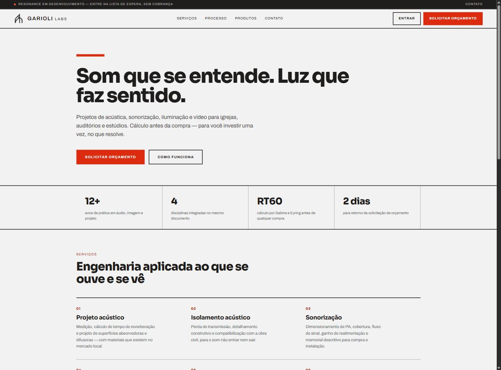<br /><sub><b>Site institucional</b> — a porta de entrada pública.</sub></td>
<td width="50%">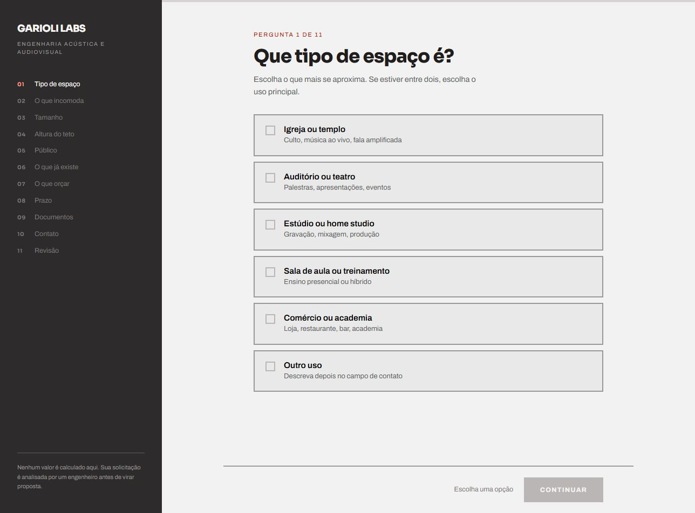<br /><sub><b>Triagem</b> — 11 passos que definem o preço, sem devolver preço ao cliente.</sub></td>
</tr>
<tr>
<td width="50%">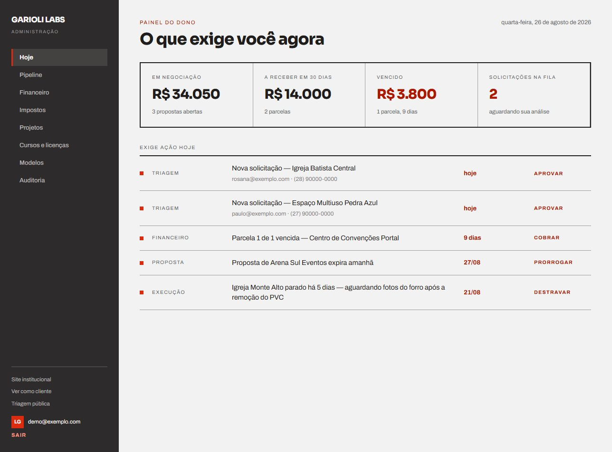<br /><sub><b>Painel do dono</b> — o que exige ação hoje, antes de qualquer relatório.</sub></td>
<td width="50%">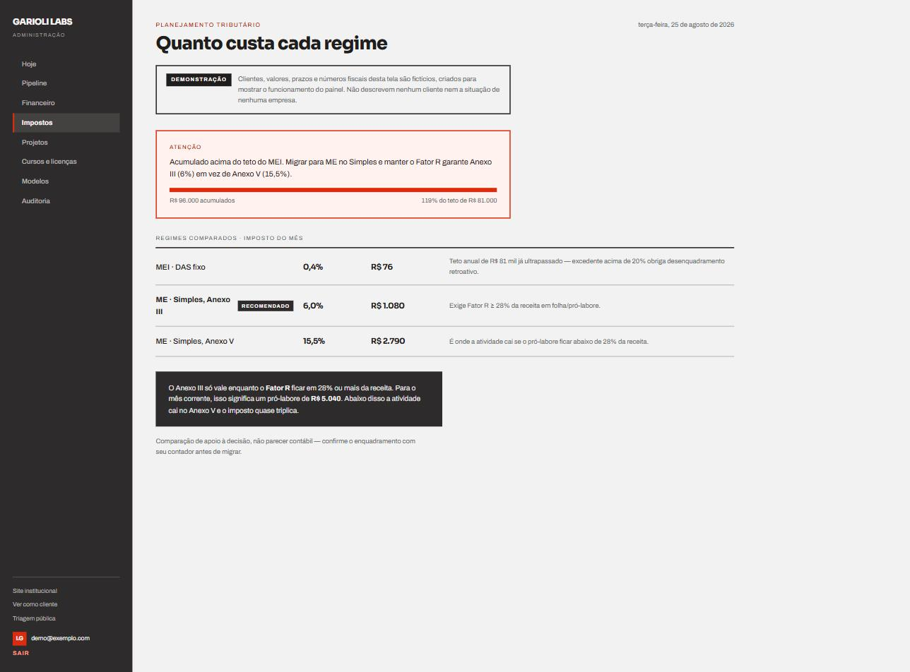<br /><sub><b>Planejamento tributário</b> — MEI × Simples Anexo III × Anexo V, com o Fator R.</sub></td>
</tr>
</table>

## A página pública

A home não é uma vitrine de adjetivos: ela é a primeira peça de prova. Oito
seções, todas ancoradas na barra de navegação com *scroll-spy*, levam o leitor
do problema ao contrato sem trocar de página.

| Seção | O que ela responde |
| --- | --- |
| Hero + números | o que a empresa faz, em uma frase e quatro medidas |
| **Antes e depois** | como o mesmo salão fica antes e depois do projeto — a divisa arrasta |
| Serviços | as seis frentes que podem ser contratadas separadamente |
| Processo | os cinco passos, da triagem à entrega |
| **Estudo de caso** | o resultado: cinco números, oito verificações normativas, quatro pranchas com carimbo, o mapa de cobertura e um modelo 3D navegável |
| Entrega | o que fica com o cliente — plantas, memorial, diagramas, comissionamento |
| Software | as ferramentas que nasceram dos projetos, com o estado de cada uma |
| Ensino | material escrito, exercícios e vídeo, ligados à mesma conta |
| Sobre + Dúvidas | quem assina, a declaração de independência, a trajetória e o FAQ |

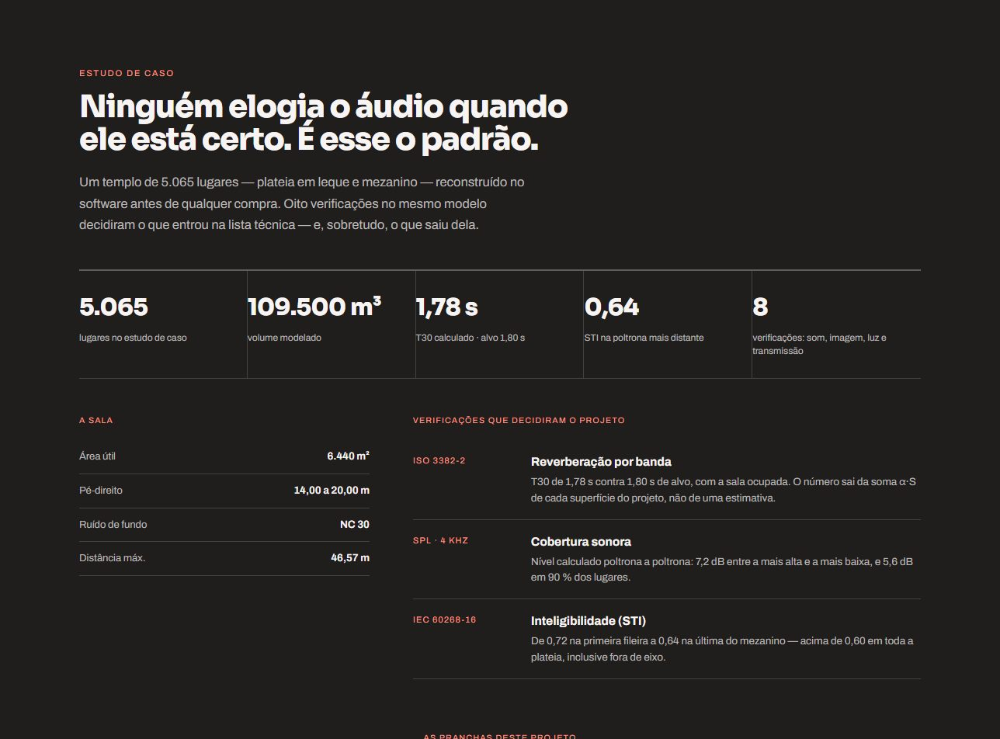

<sub><b>Estudo de caso</b> — a única faixa escura da página, para o número ser a
coisa que o olho encontra primeiro. Norma citada ao lado de cada verificação
(ISO 3382-2, SPL a 4 kHz, IEC 60268-16), e a nota final dizendo que os valores
são ilustrativos.</sub>

### O comparador antes/depois

Logo abaixo do hero, um render do mesmo salão em dois estados — como ele é hoje,
sob luz fluorescente e sem tratamento, e como fica com o projeto executado — sob
uma única divisa inclinada que o leitor arrasta. A divisa é um
`<input type="range">` transparente por cima do desenho: com isso o comparador
ganha arrasto de mouse, arrasto por toque, setas do teclado, anel de foco e nome
acessível sem uma linha de `pointermove` escrita à mão.

Os dois lados são SVG desenhado, não fotografia: gradiente por superfície,
oclusão de ambiente nos cantos, grão de sensor por cima de tudo e as fileiras de
bancos derivadas da perspectiva em vez de digitadas uma a uma. O componente
aceita `antes` e `depois` como URLs — no dia em que houver foto do salão real,
ela entra sem mexer no mecanismo.

### As pranchas e o glossário

Dentro da faixa vem o caderno técnico de um templo de 5.065 lugares: quatro
pranchas com carimbo — planta cotada, corte longitudinal A-A com o memorial de
absorção, axonometria e folha de resultados —, o mapa de cobertura sonora como
sai da ferramenta de projeto da casa e um modelo 3D que gira no navegador.

As pranchas ocupam a **página inteira**, de borda a borda — desenho de engenharia
pequeno não se lê. O que continua na coluna de texto é o que é texto: a legenda
da figura e, sob cada prancha, um glossário de quatro ou cinco verbetes. Cada
verbete tem duas linhas: o que o termo significa e, depois de uma seta, para que
serve avaliar aquilo. A primeira linha é para o engenheiro; a segunda, para quem
vai assinar o contrato.

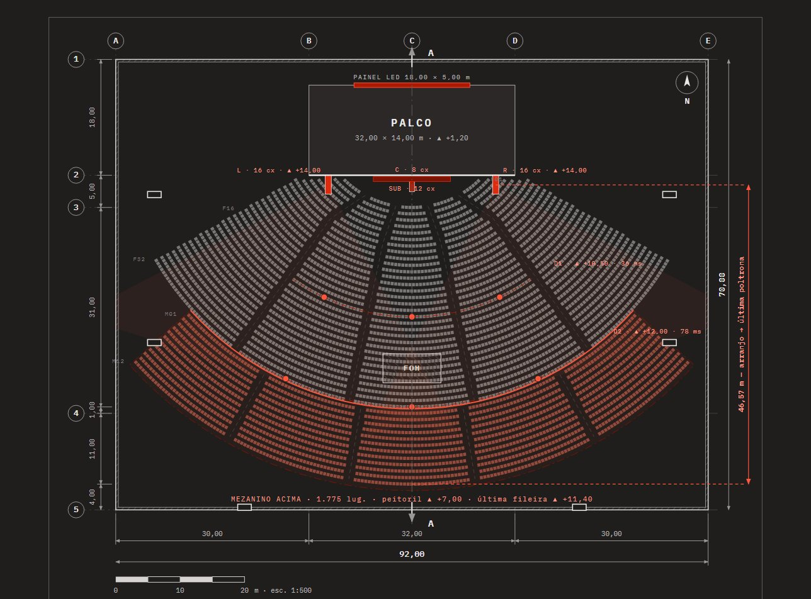

<sub><b>AC-01 · planta baixa</b> — 32 fileiras em leque, cinco blocos, quatro
corredores radiais e a cota em vermelho que dimensiona todo o sistema de som.</sub>

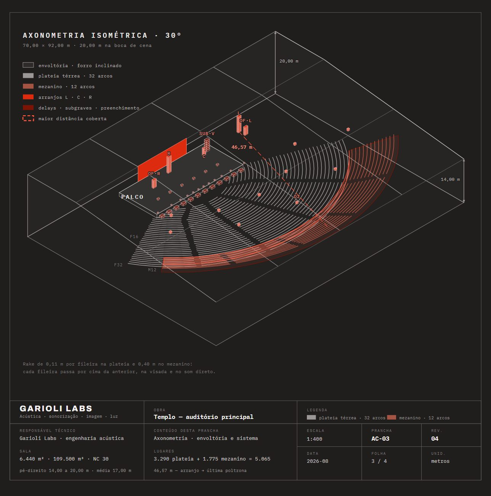

<sub><b>AC-03 · axonometria</b> — envoltória, plateia térrea, mezanino e as 33
caixas no mesmo desenho, em isométrica de 30°, com o traço da maior distância
coberta indo do arranjo até a última poltrona.</sub>

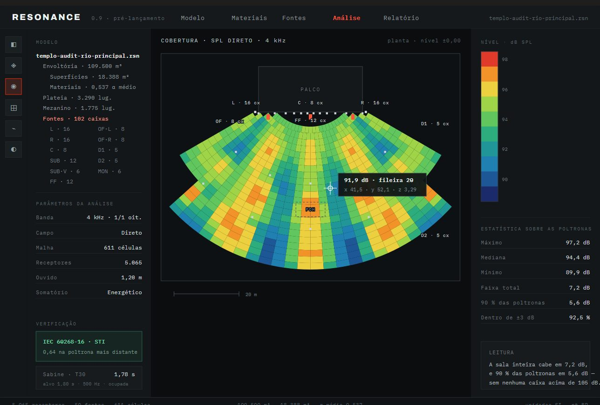

<sub><b>Cobertura sonora</b> — cada célula da malha é o nível somado em energia
das 33 caixas do sistema, medido na altura do ouvido da fileira em que ela
cai.</sub>

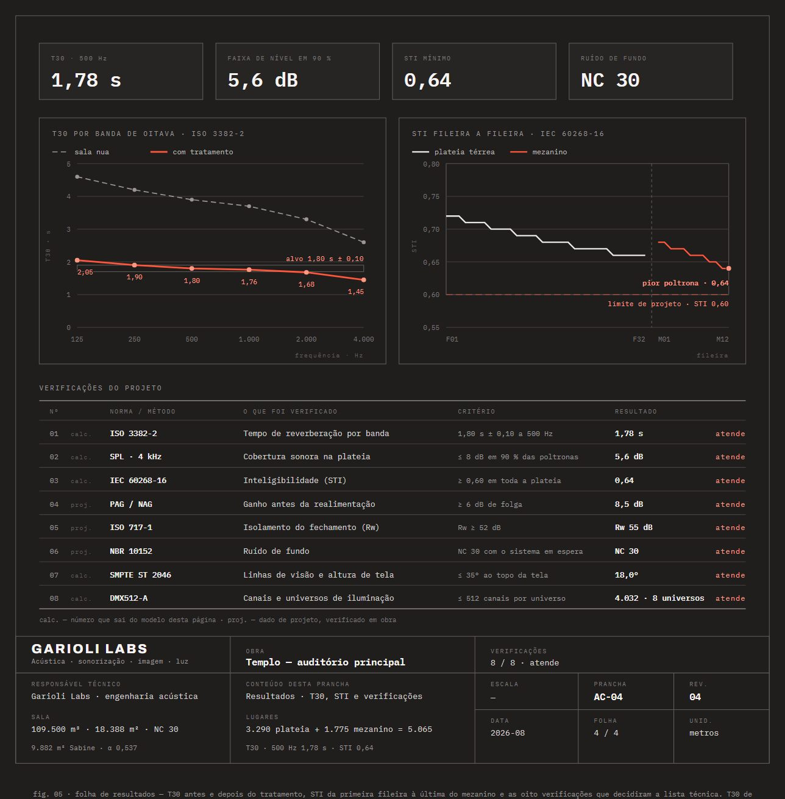

<sub><b>AC-04 · resultados</b> — T30 por banda de oitava, a sala nua contra a
sala tratada; STI fileira a fileira, plateia e mezanino; e as oito verificações
normativas com o critério ao lado do resultado.</sub>

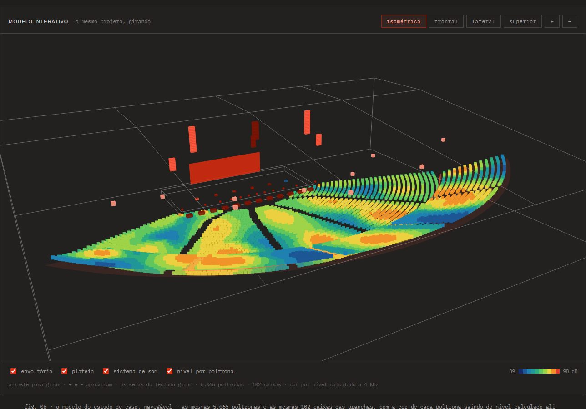

<sub><b>Modelo navegável</b> — as mesmas 5.065 poltronas e as mesmas 33 caixas
das pranchas, girando no navegador, com cada poltrona pintada pelo nível
calculado ali mesmo.</sub>

Nenhum número dessas pranchas é digitado: geometria, níveis, T30 e STI saem de
[`frontend/src/lib/desenhos/projeto.js`](frontend/src/lib/desenhos/projeto.js)
na hora em que a página é montada, e o texto do estudo de caso importa os mesmos
valores. Um erro de cálculo aparece no desenho e no texto ao mesmo tempo — nunca
em um só.

Todo o texto vive em [`frontend/src/lib/conteudo/`](frontend/src/lib/conteudo)
— um arquivo por idioma, com a mesma forma de chave, que as páginas percorrem
com `{#each}`. Nenhuma frase está escrita dentro de um componente. É o que torna
esta versão de demonstração possível sem manter duas páginas: os arquivos são os
mesmos do repositório privado, e **um único arquivo** difere —
[`frontend/src/lib/identidade.js`](frontend/src/lib/identidade.js).

| Campo | Nesta versão |
| --- | --- |
| `empresa.razao`, `empresa.cnpj`, `empresa.fone`, `empresa.email` | valores neutros de exemplo |
| `empresa.selo` | vazio — a credencial de parceria é real e não entra aqui; o rodapé simplesmente não a desenha |
| `demonstracao` | `true` — troca a nota do estudo de caso, tira as páginas do índice de busca e esvazia o sitemap |

O acordeão de dúvidas é `<details>`/`<summary>` puro: abre sem JavaScript, o
sinal `+` → `−` é CSS, e a transição respeita `prefers-reduced-motion`.

## Dois idiomas, uma base

O idioma mora na URL: `/` é o português, `/en` é o inglês, e cada rota existe
como HTML próprio nos dois idiomas, ligados por `hreflang`. Não há detecção por
navegador nem estado de idioma no cliente — o endereço é a única fonte da
verdade, que é o que um buscador consegue indexar.

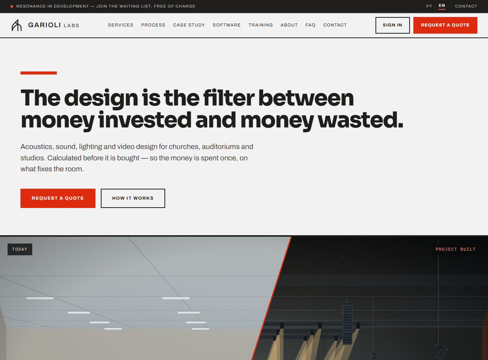

A rota é uma casca de uma linha:

```svelte
<!-- src/routes/en/orcamento/+page.svelte -->
<script>
  import Orcamento from '$lib/paginas/Orcamento.svelte';
</script>

<Orcamento lang="en" />
```

As duas rotas chamam a mesma página de `lib/paginas/`, com `lang` diferente.
Nunca existem duas cópias de uma página para divergirem — e o mesmo vale para as
pranchas, que trocam a legenda e a vírgula decimal (em inglês, ponto) sem mudar
uma única cota.

O questionário de triagem também vem traduzido, e aqui há uma regra que não pode
ser quebrada: **a chave da resposta não muda de idioma.** `Opcao.val` é sempre o
texto em português — é o que a regra de preço compara e o que fica gravado na
solicitação; `label` é o que a pessoa lê. Dois testes em `triagem.rs` seguram
isso, e o módulo em JS que o backend de demonstração usa é **gerado a partir do
Rust**, para que as duas versões não divirjam em silêncio.

O que **não** é traduzido: as cláusulas do contrato e os registros de projeto que
vêm da API. Contrato assinado sob lei brasileira e pelo Gov.br é redigido em
português; uma tradução na tela criaria uma segunda versão sem valor legal.

Toda rota é pré-renderizada — `prerender = true` no layout raiz —, então o
`build` tem um HTML pronto por página e por idioma, mais `sitemap.xml` e
`robots.txt`. Um detalhe que custa o site inteiro: o `fallback` do
`adapter-static` é **`404.html`**, e não `index.html`. Com a home
pré-renderizada, um fallback de mesmo nome sobrescreve o HTML real por uma casca
vazia — e o buscador passa a receber uma página sem conteúdo nenhum.

## Arquitetura

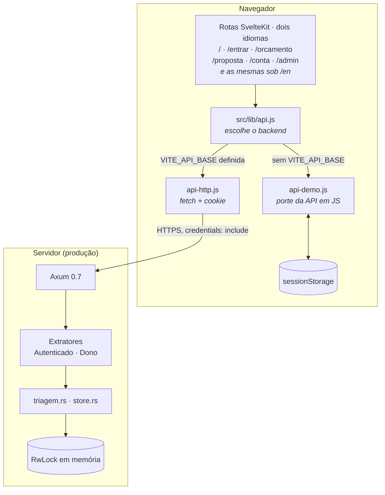
```mermaid
flowchart TB
    subgraph nav["Navegador"]
        rotas["Rotas SvelteKit · dois idiomas<br/>/ · /entrar · /orcamento<br/>/proposta · /conta · /admin<br/><i>e as mesmas sob /en</i>"]
        disp["src/lib/api.js<br/><i>escolhe o backend</i>"]
        http["api-http.js<br/><i>fetch + cookie</i>"]
        demo["api-demo.js<br/><i>porte da API em JS</i>"]
        ss[("sessionStorage")]
    end

    subgraph srv["Servidor (produção)"]
        axum["Axum 0.7"]
        ext["Extratores<br/>Autenticado · Dono"]
        dom["triagem.rs · store.rs"]
        mem[("RwLock em memória")]
    end

    rotas --> disp
    disp -->|"VITE_API_BASE definida"| http
    disp -->|"sem VITE_API_BASE"| demo
    demo <--> ss
    http -->|"HTTPS, credentials: include"| axum
    axum --> ext --> dom --> mem
```

### Dois backends, um front

O front não sabe com quem está falando. `src/lib/api.js` escolhe entre duas
implementações da mesma superfície:

| | Quando | O que roda |
| --- | --- | --- |
| `api-http.js` | `VITE_API_BASE` definida | a API Axum de verdade, com cookie de sessão `HttpOnly` |
| `api-demo.js` | sem `VITE_API_BASE` | um porte da API em JavaScript, dentro do navegador |

Nenhuma página importa uma das duas diretamente, e as duas lançam o mesmo
`ErroApi` (de `api-erros.js`) — é o que faz `instanceof` continuar valendo e o
desvio para `/entrar` no 401 ser escrito uma vez só.

É isso que deixa a demonstração ser um site estático: nada para hospedar além
de arquivos, e ainda assim todas as telas funcionam — a triagem calcula faixa de
preço, o aceite gera contrato, a assinatura fecha a trilha de auditoria.

**O que o porte preserva:** as rotas, as formas de resposta, os códigos de erro,
o cálculo da triagem, a separação cliente/dono (rota de dono responde 404) e a
trilha append-only.
**O que ele não tem:** hash Argon2id, cookie assinado e persistência — o estado
vive em `sessionStorage` e some ao fechar a aba. **Qualquer** senha de 8
caracteres entra; `demo@exemplo.com` entra como dono. A tela de acesso diz isso
e traz um botão que preenche o acesso do dono.

A lógica que importa continua sendo a do Rust — é ela que roda em produção, e é
para ela que vale olhar.

### Topologia de publicação

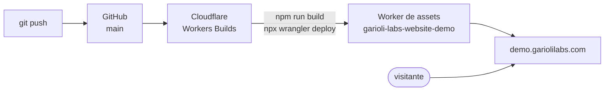
```mermaid
flowchart LR
    dev["git push"] --> gh["GitHub<br/>main"]
    gh --> wb["Cloudflare<br/>Workers Builds"]
    wb -->|"npm run build<br/>npx wrangler deploy"| wk["Worker de assets<br/>garioli-labs-website-demo"]
    wk --> dom["demo.gariolilabs.com"]
    usr(["visitante"]) --> dom
```

Worker **só de assets**: sem `main`, sem bindings, porque não existe código de
servidor nesta build. O que existe é uma linha de configuração que não é
opcional:

```jsonc
// frontend/wrangler.jsonc
"assets": {
  "directory": "./build",
  "not_found_handling": "404-page"
}
```

Com toda rota pré-renderizada, cada página existe como arquivo próprio no
`build`, nos dois idiomas: o Workers serve o arquivo pedido e, quando ele não
existe, devolve o `404.html` com status 404. O modo `single-page-application`,
usado enquanto só havia um `index.html`, devolveria 200 para qualquer endereço
inventado — o que ensina o buscador a indexar URL que não existe.

## O domínio: da triagem à assinatura

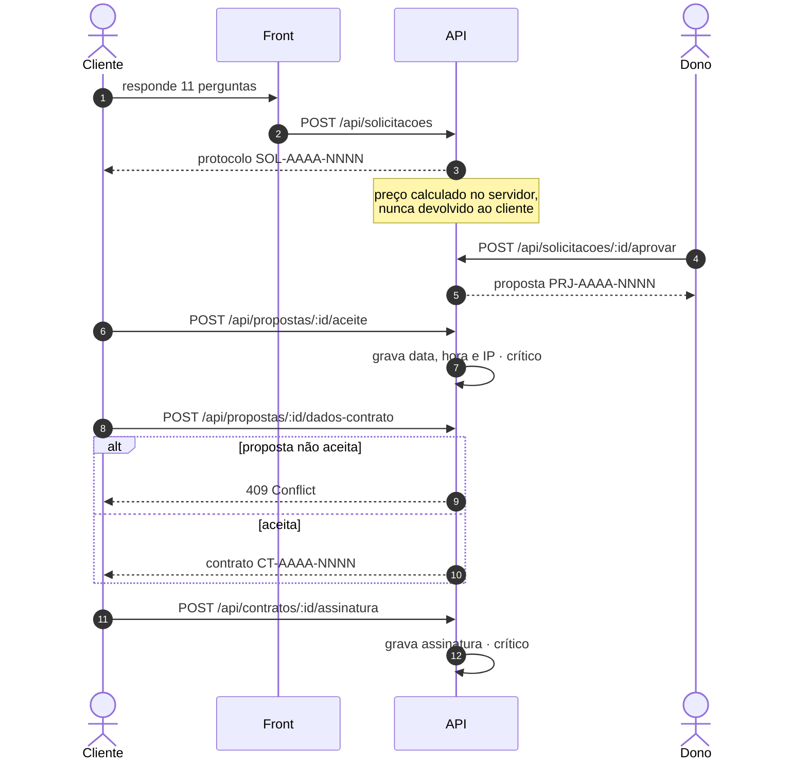
```mermaid
sequenceDiagram
    autonumber
    actor C as Cliente
    participant F as Front
    participant A as API
    actor D as Dono

    C->>F: responde 11 perguntas
    F->>A: POST /api/solicitacoes
    A-->>C: protocolo SOL-AAAA-NNNN
    Note over A: preço calculado no servidor,<br/>nunca devolvido ao cliente

    D->>A: POST /api/solicitacoes/:id/aprovar
    A-->>D: proposta PRJ-AAAA-NNNN

    C->>A: POST /api/propostas/:id/aceite
    A->>A: grava data, hora e IP · crítico

    C->>A: POST /api/propostas/:id/dados-contrato
    alt proposta não aceita
        A-->>C: 409 Conflict
    else aceita
        A-->>C: contrato CT-AAAA-NNNN
    end

    C->>A: POST /api/contratos/:id/assinatura
    A->>A: grava assinatura · crítico
```

### Estados de uma solicitação

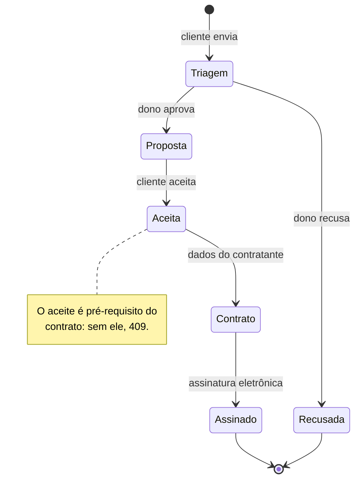
```mermaid
stateDiagram-v2
    [*] --> Triagem: cliente envia
    Triagem --> Recusada: dono recusa
    Triagem --> Proposta: dono aprova
    Proposta --> Aceita: cliente aceita
    Aceita --> Contrato: dados do contratante
    Contrato --> Assinado: assinatura eletrônica
    Assinado --> [*]
    Recusada --> [*]

    note right of Aceita
        O aceite é pré-requisito do
        contrato: sem ele, 409.
    end note
```

### A regra de preço

Uma faixa por frente de trabalho, multiplicada pela área declarada. É a única
variável de dimensionamento, e é a única lógica do repositório com dinheiro
dentro — por isso é a única com teste.

| Frente | Faixa base |
| --- | ---: |
| Isolamento acústico | R$ 3.800 – 9.200 |
| Tratamento acústico | R$ 3.200 – 7.800 |
| Projeto de sonorização | R$ 2.800 – 6.500 |
| Projeto de projeção ou vídeo | R$ 2.200 – 5.000 |
| Projeto de iluminação | R$ 1.800 – 4.200 |
| Consultoria de compra | R$ 900 – 2.400 |
| _escopo indefinido_ (diagnóstico) | R$ 2.500 – 6.000 |

| Área declarada | Multiplicador |
| --- | ---: |
| até 120 m² | 1,0 |
| 120 a 300 m² | 1,2 |
| 300 a 600 m² | 1,5 |
| mais de 600 m² | 1,9 |

```rust
#[test]
fn area_maior_aumenta_a_faixa() {
    let pequena = frentes(&nova("Até 50 m²", vec!["Tratamento acústico"]));
    let grande = frentes(&nova("Mais de 600 m²", vec!["Tratamento acústico"]));
    assert!(grande[0].minimo_centavos > pequena[0].minimo_centavos);
}
```

Valores são `i64` em **centavos**, nunca ponto flutuante: dinheiro em `f64`
acumula erro de arredondamento a cada parcela.

Certas respostas levantam alerta em vez de preço — área "não sei" exige visita,
isolamento e tratamento pedidos juntos exigem confirmar obra civil, reclamação
de vizinhos exige checar a exigência municipal de ruído.

## Decisões de projeto

Cada uma destas está no código de propósito, e a consequência é o motivo.

<details open>
<summary><b>Nenhum preço vai ao cliente na triagem</b></summary>

A faixa é calculada no servidor e só aparece no painel do dono. O cliente vê
"solicitação recebida".
**Consequência:** você não fica preso a um número que um formulário calculou
antes de alguém olhar o espaço.
</details>

<details>
<summary><b>Rota de dono responde 404, não 403</b></summary>

O extrator `Dono` recusa com `NOT_FOUND`. Um 403 confirmaria que a rota existe
e que a conta simplesmente não tem permissão.
**Consequência:** quem não é dono não descobre o mapa do painel sondando URLs.
</details>

<details>
<summary><b>A trilha de auditoria não tem caminho de remoção</b></summary>

`Store::registrar` só insere; não existe `remover`. Aceite e assinatura gravam
IP e horário e são marcados como críticos.
**Consequência:** a trilha vale como prova porque nem o dono pode editá-la.
</details>

<details>
<summary><b>Contrato exige aceite</b></summary>

`POST /dados-contrato` devolve **409** se a proposta não foi aceita.
**Consequência:** não existe contrato que ninguém aceitou — a ordem dos eventos
é garantida pelo servidor, não pela ordem das telas.
</details>

<details>
<summary><b>O texto das cláusulas vive em <code>store.rs</code></b></summary>

Gerado a partir dos dados que o cliente informa; o mesmo texto serve a tela e
ao PDF.
**Consequência:** não há duas redações do contrato divergindo em silêncio.
</details>

<details>
<summary><b>Login não diz quais contas existem</b></summary>

Senha errada e e-mail inexistente devolvem a mesma mensagem e o mesmo 401.
`senha_confere` trata até hash corrompido como `false`, nunca como erro
distinto.
**Consequência:** o formulário não vira um oráculo de cadastro.
</details>

<details>
<summary><b>Nenhuma credencial padrão no repositório</b></summary>

Sem `GARIOLI_ADMIN_SENHA`, a senha do dono é sorteada a cada início e avisada
uma vez no log.
**Consequência:** erra-se para o lado de "ninguém entra" em vez de "todo mundo
sabe a senha".
</details>

<details>
<summary><b><code>Usuario</code> não deriva <code>Serialize</code></b></summary>

Existe um `UsuarioPublico` separado, e um `From<&Usuario>` para atravessar.
**Consequência:** o hash da senha não sai numa resposta por acidente — o
compilador impede, não a revisão de código.
</details>

<details>
<summary><b>Nenhum número do painel do dono é digitado</b></summary>

O painel inteiro sai de um livro-razão só — contratos, parcelas, propostas e
produtos, em `api-demo.js`. "Em negociação", "a receber em 30 dias", "vencido",
o acumulado contra o teto do MEI e o imposto do mês são somas feitas na hora da
chamada, e a apuração que o Financeiro lê é a mesma que a tela de Impostos lê.
**Consequência:** não existe número que possa divergir de outro, porque só
existe um número. Mudar o valor de uma parcela move o topo da tela, a barra do
teto e a comparação de regimes de uma vez.
</details>

<details>
<summary><b>O cenário é escrito em deslocamento de dias, não em datas</b></summary>

Nada na demonstração guarda "12/08/2026". Guarda "assinado há 14 dias",
"vence daqui a 21", "enviada ontem, válida por 15".
**Consequência:** uma demonstração aberta daqui a dois anos continua mostrando
uma parcela vencida há nove dias e uma proposta que expira semana que vem — e
não um passado esquecido com valores que não fazem mais sentido.
</details>

<details>
<summary><b>A proposta se prova sozinha</b></summary>

O escopo é a única coisa guardada em dinheiro, item por item, em centavos.
Subtotal, desconto, total, valor da parcela e valor à vista são contas feitas na
hora de mostrar, e a cláusula 4ª do contrato recebe o mesmo número que estava na
tela quando a pessoa clicou em aceitar.
**Consequência:** o leitor confere os 10% somando três linhas que estão à vista,
e mexer no escopo nunca deixa o total mentindo.
</details>

<details>
<summary><b>A forma de pagamento faz parte do aceite</b></summary>

Parcelado ou à vista é escolhido junto com o aceite, fica na trilha de auditoria
e decide o texto e o valor da cláusula 4ª. O servidor recusa um aceite sem
escolha.
**Consequência:** o contrato diz um valor. Um documento que oferece dois é um
documento que ainda vai ser discutido.
</details>

<details>
<summary><b>CPF e CNPJ são conferidos dos dois lados</b></summary>

`lib/documento.js` dá o retorno imediato no formulário — máscara enquanto se
digita e o motivo exato do erro embaixo do campo. `backend/src/documento.rs`
repete a checagem e devolve 422.
**Consequência:** o contrato identifica a parte pelo número que foi gravado, e
um dígito verificador errado aparece na hora de preencher, não na hora de
cobrar.
</details>

<details>
<summary><b>O estado guardado da demonstração carrega um número de versão</b></summary>

`sessionStorage` guarda `{ versao, dados }`, e o que não bater com a versão da
semente é descartado.
**Consequência:** quem estivesse com a aba aberta durante um deploy que mudou a
forma dos dados recomeça da semente, em vez de ver `NaN` em todo lugar onde
havia dinheiro — que é exatamente o que acontecia quando o `catch` só pegava
JSON quebrado.
</details>

<details>
<summary><b>A comparação de regimes é apoio à decisão, não parecer contábil</b></summary>

As alíquotas e o teto do MEI são de tabela; a receita é dado fictício, como o
resto do painel. A tela diz isso.
**Consequência:** a ferramenta ajuda a conversar com o contador, sem fingir
substituí-lo.
</details>

<details>
<summary><b>A coluna "atende" da folha de resultados é uma comparação</b></summary>

Cada uma das oito linhas compara o critério com o número que o modelo devolve —
nenhuma delas tem a palavra "atende" digitada. A coluna `calc.` / `proj.` separa
o que a página calcula do que é dado de projeto a verificar em obra.
**Consequência:** se a geometria mudar e um critério deixar de ser atendido, a
prancha diz isso sozinha, e nunca alega ter calculado o que não calculou.
</details>

<details>
<summary><b>A escala de cor mora no memorial, não no desenho</b></summary>

`corDeNivel` e `faixaNivel` estão em `desenhos/projeto.js`; o mapa de cobertura
e o modelo 3D importam os dois.
**Consequência:** os dois pintam a mesma sala com a mesma escala — com uma cópia
dentro de cada desenho, bastava mexer em uma para o outro mentir por um tom.
</details>

<details>
<summary><b>O modelo 3D não sequestra a rolagem</b></summary>

Girar é arrastar; aproximar é o botão `+` / `−` ou as setas do teclado. A roda
do mouse não faz zoom.
**Consequência:** numa página longa, a roda continua pertencendo à página — e o
modelo continua operável por teclado.
</details>

## Segurança

| Superfície | Como está tratada |
| --- | --- |
| Senha | Argon2id com sal por usuário (`argon2` 0.5); texto puro nunca guardado nem registrado |
| Sessão | cookie `gl_sessao` — `HttpOnly`, `SameSite=Lax`, `Path=/`, 12 h |
| `Secure` | ligado por `GARIOLI_COOKIE_SECURE`; **obrigatório em produção** |
| Autorização | por tipo, nos extratores `Autenticado` e `Dono` — não por `if` espalhado pelos handlers |
| Enumeração de contas | mesma resposta para senha errada e e-mail inexistente |
| Vazamento de hash | impedido pelo tipo (`Usuario` sem `Serialize`) |
| CORS | lista explícita em `GARIOLI_ORIGENS`, sem curinga |
| Auditoria | append-only, com IP e horário nos eventos críticos |

O que **não** está resolvido está em [Limites conhecidos](#limites-conhecidos).

## Estrutura

```
frontend/
  src/lib/design-system.css   design system Modernist (tokens + componentes), copiado íntegro
  src/lib/app.css             utilitários do projeto (.display, .kicker, .btn-solid…)
  src/lib/api.js              escolhe o backend: HTTP real ou demonstração
  src/lib/api-http.js         cliente da API Axum — um método por endpoint
  src/lib/api-demo.js         porte da API em JS, roda no navegador (build de portfólio)
  src/lib/api-erros.js        ErroApi e o desvio para /entrar, compartilhados pelos dois
  src/lib/triagem-en.js       questionário em inglês, gerado de backend/src/triagem.rs
  src/lib/documento.js        dígitos verificadores de CPF e CNPJ, máscara e regra por campo
  src/lib/identidade.js       dados cadastrais e `demonstracao` — o único arquivo que difere do repositório privado
  src/lib/conteudo/pt.js      todo o texto do site em português, em arrays
  src/lib/conteudo/en.js      o mesmo, em inglês, com a mesma forma de chave
  src/lib/conteudo/index.js   idioma da rota, tradução de caminho (/ ↔ /en) e âncoras
  src/lib/seo.js              JSON-LD: ProfessionalService, WebPage e FAQPage
  src/lib/Seo.svelte          título, descrição, canônica, hreflang, Open Graph, dados estruturados
  src/lib/Nav.svelte          barra de navegação com scroll-spy escrito direto no DOM e troca de idioma
  src/lib/Footer.svelte       rodapé com dados da empresa e selo de parceria (omitido quando vazio)
  src/lib/paginas/*.svelte    as páginas de verdade; recebem `lang` e leem conteudo/
  src/lib/desenhos/projeto.js memorial do estudo de caso: geometria, fontes, SPL, T30, STI
  src/lib/desenhos/rotulos.js legendas das pranchas nos dois idiomas e formato de número
  src/lib/desenhos/*.svelte   AC-01 planta, AC-02 corte, AC-03 axonometria, AC-04 resultados,
                              mapa de cobertura e modelo navegável — SVG e canvas calculados
  src/app.html                shell: fontes, ícones da aba, manifest, `lang` da página
  src/hooks.server.js         carimba o `lang` do idioma da rota na pré-renderização
  src/routes/+layout.js       prerender = true — toda rota vira HTML no build
  src/routes/<rota>/          casca de uma linha por rota e por idioma; ambas chamam a
  src/routes/en/<rota>/       mesma página de lib/paginas/, com `lang` diferente
  src/routes/sitemap.xml/     sitemap com os dois idiomas declarados um ao outro (vazio nesta versão)
  src/routes/robots.txt/      `Disallow: /` nesta versão; libera no site real
  wrangler.jsonc              publicação como Worker de assets

backend/
  src/models.rs    tipos de domínio (serde) + `Proposta::publica`, que deriva preço e datas do escopo
  src/documento.rs validação de CPF, CNPJ e e-mail na fronteira do servidor + testes
  src/auth.rs      senha (Argon2id), cookie de sessão e os extratores Autenticado / Dono
  src/triagem.rs   questionário + regra de preço por frente e multiplicador de área + testes
  src/store.rs     estado em memória, trilha de auditoria append-only, texto das cláusulas
  src/main.rs      rotas Axum

.github/workflows/ci.yml      build, testes e clippy da API; build e dry-run do front
docs/img/                     capturas usadas neste README
```

### O que vale olhar primeiro

| Onde | Por quê |
| --- | --- |
| `backend/src/auth.rs` | dois extratores que fecham a API pelo tipo, não por `if` espalhado |
| `backend/src/triagem.rs` | regra de preço com teste garantindo que área maior nunca sai mais barata |
| `backend/src/store.rs` | trilha append-only e o texto das cláusulas gerado dos dados do cliente |
| `frontend/src/lib/api.js` | o dispatcher de três linhas que deixa a demonstração existir |
| `frontend/src/lib/api-demo.js` | o livro-razão `NEGOCIO`: cada número do painel do dono é uma soma dele, nenhum é digitado |
| `backend/src/models.rs` | `Proposta::publica` — subtotal, desconto, total, parcela e prazo saem todos do escopo em centavos |
| `frontend/src/lib/conteudo/` | o site inteiro como dado, nos dois idiomas — um arquivo separa esta versão da privada |
| `frontend/src/lib/desenhos/projeto.js` | o memorial que as quatro pranchas, o mapa e o modelo desenham: nenhuma cota é digitada duas vezes |
| `frontend/src/lib/Nav.svelte` | scroll-spy escrito direto no DOM, fora do caminho reativo |
| `frontend/src/routes/orcamento/` | triagem de 11 passos que não devolve preço ao cliente |

## Endpoints

Rotas marcadas **dono** respondem 404 — não 403 — para quem tem sessão mas não é
dono: a rota não se anuncia a quem não é dela.

| Método | Rota | Para quê |
| --- | --- | --- |
| GET | `/api/health` | sonda de saúde |
| POST | `/api/auth/entrar` | login → cookie `gl_sessao` |
| POST | `/api/auth/criar-conta` | conta de cliente |
| POST | `/api/auth/sair` | encerra a sessão no servidor |
| GET | `/api/auth/eu` | quem está na sessão |
| GET | `/api/triagem/schema?lang=pt\|en` | questionário no idioma pedido (o front não hardcoda perguntas) |
| POST | `/api/solicitacoes` | envio da triagem → protocolo |
| GET | `/api/solicitacoes` | fila do admin · **dono** |
| POST | `/api/solicitacoes/:id/aprovar` | aprovação → gera proposta · **dono** |
| POST | `/api/solicitacoes/:id/recusar` | recusa · **dono** |
| GET | `/api/propostas/:id` | proposta para o portal |
| POST | `/api/propostas/:id/aceite` | aceite com observações e forma de pagamento (grava IP e hora; 422 sem a forma) |
| POST | `/api/propostas/:id/dados-contrato` | dados do cliente → gera contrato (409 sem aceite, 422 com CNPJ/CPF/e-mail inválido) |
| GET | `/api/contratos/:id` | contrato gerado |
| POST | `/api/contratos/:id/assinatura` | assinatura eletrônica |
| GET | `/api/conta/me` | painel do cliente · **autenticado** |
| GET | `/api/admin/resumo` | KPIs, pipeline, financeiro, execução · **dono** |
| GET | `/api/admin/auditoria` | trilha imutável · **dono** |
| GET | `/api/admin/impostos` | MEI × Simples Anexo III × Anexo V · **dono** |

## Rodar localmente

Requisitos: Rust estável e Node 22+.

```bash
# API (porta 8080)
cd backend
GARIOLI_ADMIN_SENHA="escolha uma senha" cargo run

# Front (porta 5173, com proxy /api → 8080)
cd frontend
npm install
npm run dev
```

Sem `GARIOLI_ADMIN_SENHA`, a conta do dono nasce com uma senha sorteada, avisada
uma vez no log de inicialização — nenhuma credencial padrão mora neste
repositório, e não deve passar a morar.

| Variável | Para quê | Sem ela |
| --- | --- | --- |
| `GARIOLI_ADMIN_SENHA` | senha da conta do dono | sorteia uma e avisa no log |
| `GARIOLI_ADMIN_EMAIL` | e-mail da conta do dono | `demo@exemplo.com` |
| `GARIOLI_COOKIE_SECURE` | marca o cookie de sessão como `Secure` | cookie sem `Secure` — só para desenvolvimento em http |
| `GARIOLI_ORIGENS` | origens aceitas pelo CORS, separadas por vírgula | `http://localhost:5173,http://127.0.0.1:5173` |
| `VITE_API_BASE` | base da API para o front | modo demonstração (backend no navegador) |

Em produção, `GARIOLI_COOKIE_SECURE` é obrigatório: sem ele o cookie de sessão
viaja em claro.

Para rodar o front **como a demonstração publicada**, basta não definir
`VITE_API_BASE` — nenhuma API precisa estar de pé.

## Testes e CI

```bash
cd backend && cargo test          # regra de preço, saídas da triagem, dígitos de CPF/CNPJ e a conta da proposta
cd backend && cargo clippy --all-targets -- -D warnings
cd frontend && npm run build      # build de portfólio, sem VITE_API_BASE
```

O pipeline em [`.github/workflows/ci.yml`](.github/workflows/ci.yml) roda os
quatro passos em cada push e cada PR para `main`, e ainda valida a configuração
de publicação com `wrangler deploy --dry-run` — para que uma configuração
quebrada apareça no PR, não no deploy.

## Publicar

A build de portfólio é estática. Vai ao ar pelo **Cloudflare Workers Builds**,
ligado a este repositório: cada push em `main` reconstrói e republica.

| Campo do projeto | Valor |
| --- | --- |
| Nome do projeto | `garioli-labs-website-demo` |
| Diretório raiz | `frontend` |
| Comando da build | `npm run build` |
| Comando de implantação | `npx wrangler deploy` |
| Variáveis de ambiente | nenhuma — definir `VITE_API_BASE` tiraria o site do modo demonstração |

O nome do Worker em `wrangler.jsonc` precisa continuar batendo com o nome do
projeto; se divergir, um `wrangler deploy` manual cria um segundo Worker e o
domínio segue apontando para o primeiro.

Manualmente:

```bash
cd frontend
npm run build
npx wrangler deploy
```

## Limites conhecidos

Nada aqui é surpresa em produção — está listado porque falta mesmo.

1. **Persistência** — hoje é `RwLock` em memória; trocar por PostgreSQL (sqlx)
   não muda as rotas. Sessões e usuários vivem no mesmo `Store`, então a troca
   não muda a assinatura de nada.
2. **Recuperação de senha** — `/entrar` diz com todas as letras que o link
   automático não existe e manda escrever para o e-mail da empresa. Precisa de
   envio de e-mail para virar fluxo real.
3. **Assinatura eletrônica** — `assinar_contrato` marca a data localmente. A
   integração real (Gov.br ou Autentique) deve guardar o hash do documento
   devolvido pelo provedor.
4. **Geração de PDF** — `pdf_url` aponta para rota inexistente. Os PDFs atuais
   saem das páginas HTML deste projeto; para gerar pelo servidor, renderize as
   cláusulas com `typst` ou headless Chrome.
5. **Agente de dúvidas** — o campo de perguntas do portal responde com texto
   fixo. Plugue seu LLM.
6. **E-mail / WhatsApp** — nenhum envio real acontece.
7. **Rate limiting** — não há. Antes de expor a API de verdade, `/api/auth/*`
   precisa de limite por IP.
8. **Layout responsivo** — o desenho é feito para desktop. Só a faixa do estudo
   de caso e a barra de navegação têm tratamento abaixo de 1080 px; as demais
   grades ainda são de coluna fixa. Falta uma passada de mobile no site inteiro.
9. **Idiomas** — português e inglês. Um terceiro idioma pede um arquivo em
   `lib/conteudo/`, uma entrada em `IDIOMAS`, um diretório de rotas espelhando os
   existentes e a tabela correspondente em `desenhos/rotulos.js` e em
   `backend/src/triagem.rs`.

## Licença

Código aberto para leitura e avaliação. A marca, os textos institucionais e a
identidade visual da Garioli Labs não são de uso livre.
